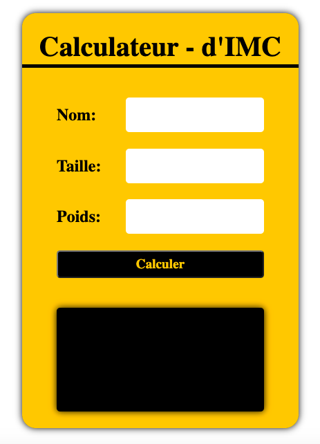

# calculateur-d-IMC

> Practice testing JavaScript.
> Cette mini-project calcule le IMC(indice de masse corporelle) en tapant le  nom , la taille et le poids de la personne et ensuite le logiciel present l'IMC et affiche aussi un message concernant le poids.

## Developpé en

- JavaScript
- HTML
- CSS

## Auteur

👤 **Neto Daniel ZINGA**

- Github: [@dannyclever](https://github.com/dannyclever)
- Email: [Daniel Larbi Addo](danielnzinga5@gmail.com)

[Version live](https://dannyclever.github.io/calculateur-d-IMC/)
